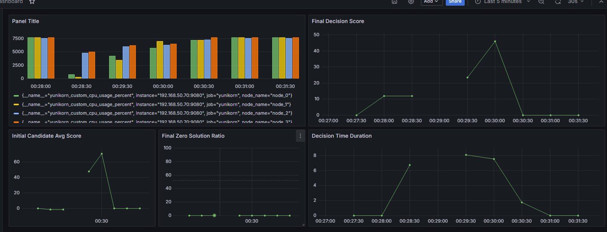

# NTCU 114級 畢業專題

## 修正 node 資源無變動的問題

為了瞭解 node 的資源量變動，在 `/pkg/metrics/custom.go` 裡新增一個 metric。將其用 grafana 顯示出來後是每個時間軸都一樣的資源量。

原因是在自己寫的 node.go (`/pkg/custom/metadata/node/node.go`) 裡，雖然有將 node 的指標作為輸入，但並沒有去紀錄節點資源量的變動，所以才會所有時間軸都一樣。

在簡單瀏覽過 source code (`/pkg/scheduler/objects/node.go`) 後，發現有特定函式可以使用，但在套用過後有個新的問題， pod 在刪除後不會返還資源。

## 修正排程方法

因為上面的新問題，我在瀏覽過 source code 後，發現需要更新資訊的不只有 node ，還有如 application 與 allocation 等等。因為在刪除時， source code 會去檢查 application 有沒有 allocate
，但由於沒有更新對應的 application ，所以它沒有辦法將執行完的 pod 刪除。

為了避免需要寫太多更新資訊的程式碼，我將 `/pkg/scheduler/partition.go` 、 `/pkg/scheduler/objects/queue.go` 、 `/pkg/scheduler/objects/application.go` 這三個程式碼檔案新增了關於自己的排程方法，實際實作則是抄原先的 tryAllocate 的程式碼，只是將一些沒有用到的程式碼區塊刪除。

## 目前問題： master node 有 taint ，無法將 pod 放上去
之後須撰寫相關程式碼，目前的排成將 master node 排除在外。
另外，由於須排程的 allocationKey 也是放在自己寫的下面，之後需要將 YuniKorn 內部的資訊題取出來做排程，而不是自己記錄。還有 YuniKorn 原生會有 allocationKey 的排序，所以如果要對每個 pod 做更細部的管理的話，需要再話。

目前成果為：
