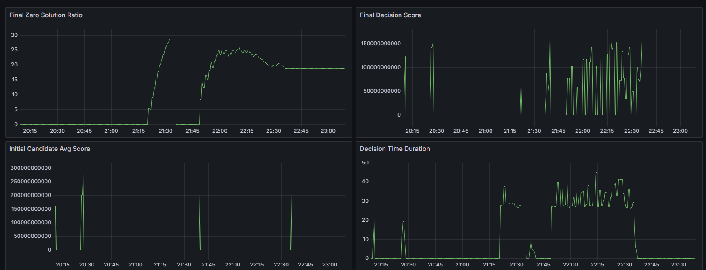

## 已完成 AGA，將需要資訊透過 prometheus exports 出來

在 `/pkg/metrics/` 下面新增一個 `custom.go` ，裡面存放了需要資訊的 metric ，同時也有去調整了 `/pkg/metrics/init.go` 內部的程式碼。

## score 數值過大
執行 YuniKorn 就能在 grafana 那邊新增圖表。從 grafana 的圖可以看到有關 score 的數值非常大

目前的「效率評分」是使用「候選解所產生資源量」到「叢集資源量上限」的距離作為分數，缺點在於數值可能過大，尤其需要除以公平性分數 (1 ~ 1/user)。
預計使用「使用比例(0% ~ 100%)」做為新的「效率分數」。

## 分配全零
理論上來說，如果初始解有一個 score 不為無限大，則演算法應收斂至附近點，那麼就有可能有一個候選解來代替全零的變數初始值。

但是我們可以從分配全零的比例(左上)得出，即便 AGA 改善了 GOA 的「要求初始解品質」的問題，卻仍然會遇到類似問題。
當然也有可能是演算法內部的問題，但調整亂數產生的規則壹就可以改善此問題。

目前將打算以「使用者可分配數量」代替「使用者要求分配數量」作為隨機數的上限。舉個例子，如果使用者要求 1000 個 pod ，而每個 pod 要求 (1 Gi, 0.5 vCore)，當前的隨機數上限為 1000，預計將改為(叢集上限 / 主導資源) 作為上限。